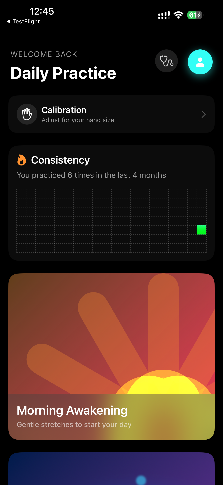
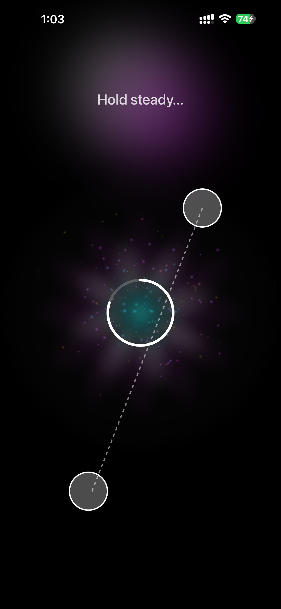
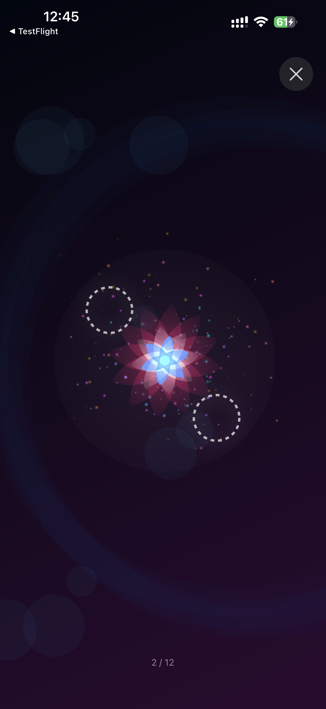
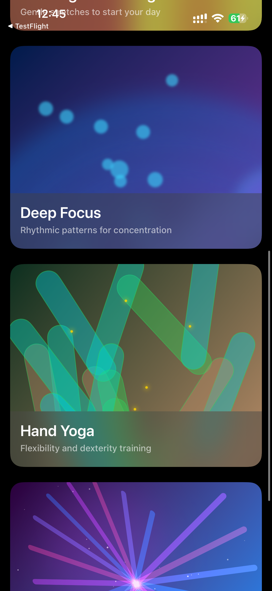
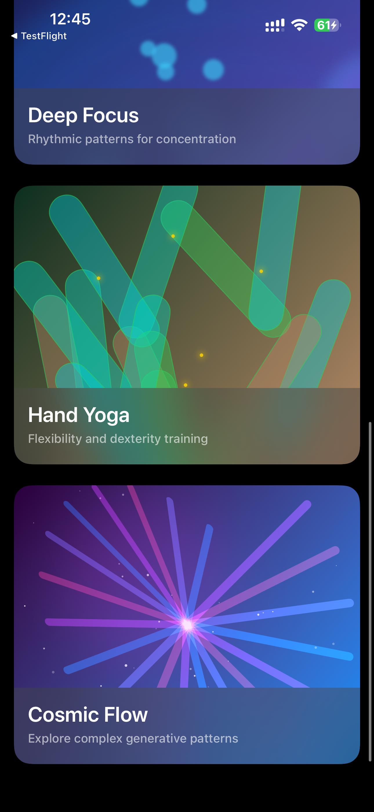
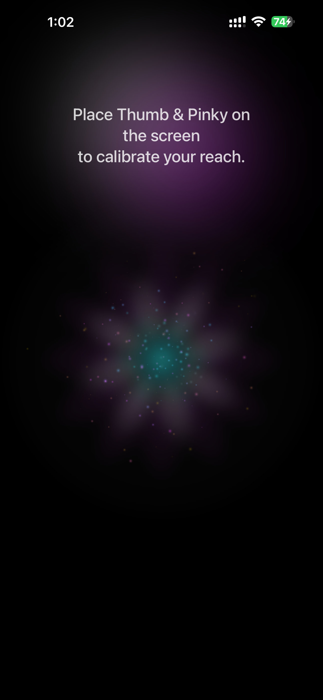
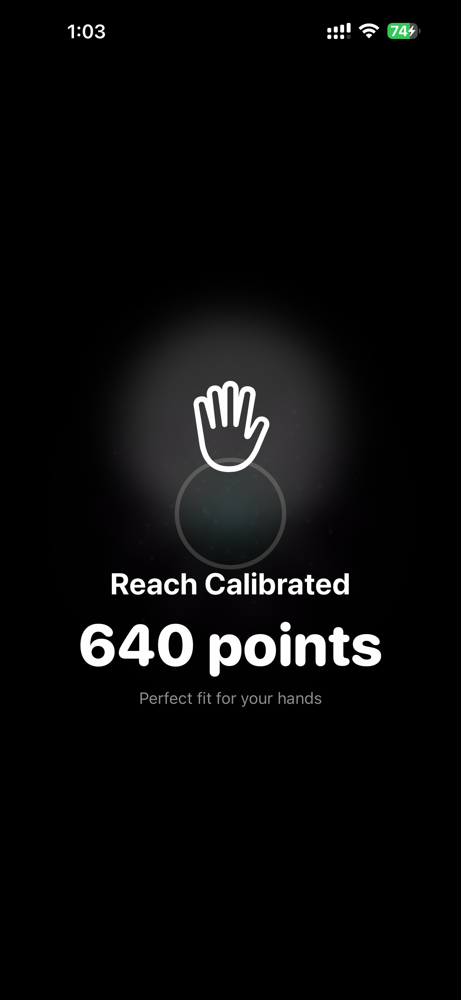
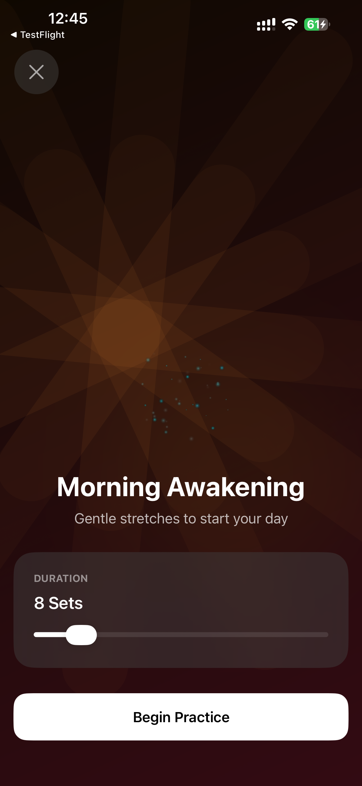
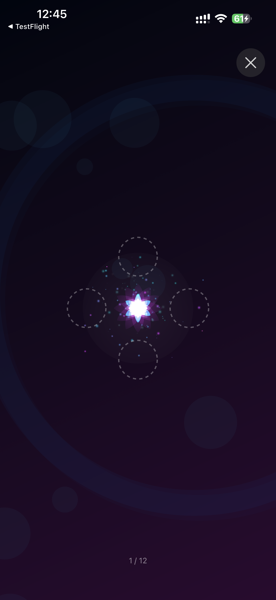
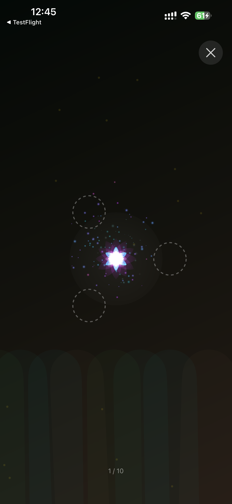

# Bloom

**Grip-free, multi-touch hand exercise for burn recovery, on iPhone.**

Bloom turns finger-stretching exercises into a short guided practice. The phone lies flat, the patient rests their hand on the screen, and dotted targets appear around a glowing flower. Holding every target at once, with the fingers spread to reach them, makes the flower bloom and advances to the next set. Targets are placed according to a quick reach calibration, so the stretch is scaled to each hand.

| | |
|---|---|
| **Status** | Functional prototype, distributed to testers through TestFlight. Active development December 2025 to January 2026. Not under active development. |
| **Platform** | iOS 26+, iPhone. SwiftUI, SwiftData, Swift Charts, SpriteKit. |
| **Server** | Optional WebSocket relay (Swift, Hummingbird) for Therapist Mode, deployed on Fly.io. |
| **License** | GNU General Public License v3.0 |

<p align="center">
  
  
  
</p>

## Contents

- [Background](#background)
- [How a session works](#how-a-session-works)
- [Practice modules](#practice-modules)
- [Therapist Mode](#therapist-mode)
- [Screenshots](#screenshots)
- [Technical overview](#technical-overview)
- [Building and running](#building-and-running)
- [Repository structure](#repository-structure)
- [Known limitations](#known-limitations)
- [Team and acknowledgments](#team-and-acknowledgments)
- [License](#license)

## Background

Recovery from a hand burn usually involves months of stretching. Healing skin and grafts can tighten, and without regular finger extension and abduction (spreading) the hand loses range of motion. Occupational therapists prescribe these stretches as home exercises, often with putty, foam, or bands, and keeping up with them between clinic visits is a known challenge.

Bloom was designed around three constraints:

- **No gripping.** Many patients cannot comfortably hold a device or a tool. Bloom is used with the phone lying flat and the hand resting on the glass.
- **Scaled to the hand.** A stretch that is trivial for one patient is out of reach for another. Bloom measures each patient's comfortable reach before practice and places targets relative to it.
- **A reason to come back.** Repetitive exercises are easy to skip. Bloom wraps the stretch in a calm visual reward and keeps a practice history on the home screen.

Bloom is a research prototype from the USC Creative Media & Behavioral Health Center. It is not a medical device and has not been evaluated in a clinical study.

## How a session works

### 1. Calibrate reach

From the home screen, **Calibration** asks the patient to place thumb and pinky on the screen and hold still. After 1.5 seconds the distance between the two touch points is recorded as the patient's reach span and shown as a point value ("Reach Calibrated, 640 points"). Every target pattern in the session is scaled from this number.

### 2. Pick a module and a length

The home screen lists four practice modules. Choosing one opens a setup screen with a slider for session length, measured in **sets** (5 to 30; each module has its own default). One set is one target pattern to hold.

### 3. Stretch, hold, bloom

During practice a flower sits near the center of the screen and one to four dotted rings appear around it. The patient spreads their fingers so that every ring is covered at the same time. When all rings are held, the flower blooms and the rings light up. After a one-second hold the set is complete, the flower shifts color, and the next pattern appears. A counter at the bottom of the screen shows progress ("2 / 12"), and an exit button is always available.

Patterns vary in the number of fingers required, the distance from center, and the angle, so the hand has to reposition and re-spread between sets. Completing the last set shows a confetti "Session Complete" screen and records the session in the practice history.

## Practice modules

Each module is a sequence generator. Given the calibrated span and the number of sets, it produces a list of target patterns. Sizes below are relative to the calibrated span (for two-finger patterns) or to half the span, the base radius (for one-, three-, and four-finger patterns).

| Module | Theme | Default sets | Sequence |
|---|---|---|---|
| **Morning Awakening** | Sunrise | 8 | Warm-up. The first third of the sets are single-finger targets at 0.8× radius, walking around a circle. The remaining sets are two-finger spans at 0.9× span, alternating horizontal and vertical with a small random tilt. |
| **Deep Focus** | Deep Ocean | 12 | Structured. The angle steps through 0°, 45°, 90°, 135°. Every third set is a four-finger square at 0.8× radius; the others are two-finger spans at full span. |
| **Hand Yoga** | Forest | 10 | Wide stretches. The angle advances 60° per set. Even sets are a three-finger triangle at full radius; odd sets are a two-finger span at 1.1× span. |
| **Cosmic Flow** | Nebula | 15 | Unpredictable. Every set is random: one to four fingers, a random angle, and a size between 0.7× and 1.0×. |

The four target patterns:

| Pattern | Fingers | Geometry |
|---|---|---|
| Focus Point | 1 | One target at the given radius and angle. |
| Span | 2 | Two targets on opposite sides of the center, each half the span away from it, along the given angle. |
| Triangle | 3 | Three targets 120° apart on a circle of the given radius. |
| Square | 4 | Four targets 90° apart on a circle of the given radius. |

## Therapist Mode

A second phone running Bloom can act as a therapist's console. The patient's profile sheet shows a six-digit session code. A therapist opens **Therapist Mode** (the stethoscope button), enters the code, and sees the patient's total session count and most recent module. The therapist can pick a module and a set count and send it as a recommendation; the patient gets an alert with a **Start Now** button that opens that module pre-configured.

Both phones connect to a small relay server (see [Relay server](#relay-server)). The relay keeps no data. It forwards messages between the devices that share a code.

## Screenshots

**Home**

<p>
  
  
  
</p>

Daily Practice home screen: the calibration entry, the consistency heat map (one cell per day over the last 20 weeks), and the four module cards with generated artwork.

**Reach calibration**

<p>
  
  
  
</p>

Prompt, hold (the dashed line is the measured span; the ring fills over 1.5 s), and result.

**Session**

<p>
  
  
  
  
</p>

Setup screen; a Square pattern waiting for four fingers; a Span pattern held with the flower in bloom; a Triangle pattern in Hand Yoga. The module's background art is dimmed behind the targets.

## Technical overview

### iOS app

**Stack.** Swift, SwiftUI, iOS 26 deployment target, iPhone only. SwiftData for persistence, Swift Charts for the heat map, SpriteKit for particles, UIKit for raw multi-touch. Two Swift Package dependencies: [Starscream](https://github.com/daltoniam/Starscream) 4.0.8 (WebSocket client) and [Vortex](https://github.com/twostraws/Vortex) 1.0.4 (confetti).

**Navigation.** `ContentView` is a three-state machine: `home`, `calibration`, and `gardening(Course)`. Home and calibration are locked to portrait. Entering a session presents `BloomView` as a full-screen cover and lifts the orientation lock so the phone can lie flat in any orientation. The calibrated span lives in `ContentView` state and is passed into the session.

**Multi-touch input.** SwiftUI's gesture system does not expose arbitrary simultaneous touches, so `TouchInputView` wraps a `UIView` with `isMultipleTouchEnabled` and overrides the four `touches…` methods. On every event it reports the full set of active touches from `event.allTouches` as `[TouchPoint]` (a stable id and a location in the view's coordinates). Both the calibration screen and the session place a transparent instance of this view over the visuals.

**Reach calibration** (`CalibrationViewModel`). The view model watches for exactly two touches more than 50 pt apart. When it sees them it starts a 1.5 s timer that drives the progress ring; if the touch count changes before the timer finishes, it resets. On completion the distance between the two points, in screen points, is the span. A result overlay shows for two seconds and the app returns home.

**Step generation** (`BloomView.generateCourse`, `CourseStrategy`). At the start of a session the span is clamped to the shorter screen dimension minus 100 pt so that patterns always fit on screen; on an iPhone this means the widest pattern is about 330 pt across. The module's strategy then emits one `CourseStep` per set, each holding a `GesturePattern` (single, dual, tri, or quad) plus a fixed hold duration of 1.0 s. Pattern geometry is computed by `GesturePattern.getTargets()`, which returns target points relative to the screen center.

**Match detection** (`BloomView.checkGameState`). Every touch update recomputes the match. A pattern is matched when the number of active touches is at least the number of targets and every target has some touch within 40 pt of it (targets are drawn as 60 pt dashed rings). Matching flips `isBlooming`, which drives the flower and ring animations, and starts the hold: after 1.0 s the step is marked complete, the flower gets a random hue shift of 60° to 180°, a new idle scale, and a small positional offset, and input is ignored for 0.5 s while the next pattern fades in. Completing the final step inserts a `PracticeLog` and shows the completion screen.

**Visual feedback.** `FlowerView` layers three rotating rings of petals (12, 8, and 6) over a blurred pistil and animates radius, scale, and rotation between idle and bloom. `BloomParticles` is a SpriteKit emitter of soft drifting motes behind everything; `TouchParticleOverlay` attaches a small emitter to each fingertip and removes it when the finger lifts. `ThemePatterns` provides an animated background per module (sunrise rays, ocean bubbles, forest columns, nebula streaks) shown at 20% opacity during play, and a static version used as card artwork on the home screen. Confetti on completion is a Vortex `.confetti` burst.

**Persistence and consistency tracking.** Two SwiftData models: `UserProfile` (first name, last name, avatar color) and `PracticeLog` (date, module title, sets completed). `HeatMapChart` queries logs from the last 140 days, aligned to end on a Saturday, and draws a 20 × 7 grid of `RectangleMark`s with Swift Charts, plus a summary line ("You practiced 6 times in the last 4 months").

**Therapist Mode, client side.** `RemoteManager` (an `@Observable` object injected through the environment) owns the connection and role. On launch the home screen connects as a **patient** with a freshly generated six-digit code and, once connected, sends a state update (session count and last module). A therapist connects with the patient's code, sends a `requestState`, and receives the patient's state. `BloomClient` wraps Starscream: it normalizes the server URL (`http(s)` becomes `ws(s)`), appends `/ws/bloom?userId=…&roomCode=…`, sends a ping every 30 s, and dispatches events back on the main queue. The server URL is stored in `UserDefaults` under `serverURL` and can be edited in the profile sheet or on the Therapist Mode screen.

**Message protocol.** Every frame is a JSON `BloomMessage` envelope: `id` (UUID), `type`, and `data`, where `data` is the JSON-encoded payload carried as a base64 string. The relay does not inspect messages; clients ignore types that are not meant for their role.

| `type` | Sent by | Payload |
|---|---|---|
| `handshake` | either | `role` (`patient` or `therapist`), `roomCode` |
| `stateUpdate` | patient | `totalPracticeCount`, `recentCourse`, `lastPracticeDate` |
| `requestState` | therapist | none |
| `recommendCourse` | therapist | `courseTitle`, `setDuration` |

### Relay server

`Server/` is a Swift package (`PlayPenBloom`, executable `PlayPen`) built on [Hummingbird 2](https://github.com/hummingbird-project/hummingbird) with `HummingbirdWebSocket`. It exposes two routes:

- `GET /` returns a plain-text health string.
- `GET /ws/bloom?userId=<uuid>&roomCode=<code>` upgrades to a WebSocket.

`ConnectionManager` is a `ServiceLifecycle` service. Each upgraded connection is handed to a `RoomManager` actor that keeps a dictionary of rooms keyed by the upper-cased room code. A room holds an `OutboundConnections` actor with one `AsyncChannel` per client. Every text frame received from a client is re-broadcast to every client in the same room, including the sender. Frames are capped at 1 MB. When the last client leaves, the room is deleted. The server holds no state beyond live connections and never writes anything to disk.

The test target contains one XCTest that boots the application in-process and checks the health route.

### Deployment and CI

- **Docker.** `Server/Dockerfile` is a two-stage build: `swift:6.1-noble` compiles a release binary with a static Swift stdlib and jemalloc; the runtime image is `ubuntu:noble` running as a non-root user on port 8080.
- **Fly.io.** `Server/fly.toml` targets the app `opbloom` in region `sjc` on one shared CPU with 1 GB of memory, with machines that stop when idle and start on the first request. The default server URL in the app is `wss://opbloom.fly.dev`. Because machines auto-stop, the first connection after a quiet period can take a few seconds.
- **GitHub Actions.** `.github/workflows/server-ci.yml` runs `swift test` in a `swift:latest` Linux container on pushes and pull requests that touch `Server/`.

## Building and running

### Requirements

- Xcode 26 or later and an iPhone running iOS 26 or later. Multi-finger patterns need a physical device; the Simulator can only synthesize two-finger pinches.
- For the server: a Swift 6.0+ toolchain (macOS 14+ or Linux), and optionally Docker and the Fly CLI.

### iOS app

1. Open `Bloom.xcodeproj` in Xcode.
2. Select the `Bloom` scheme and your device, set your own signing team, and run.

The app works fully offline. Only Therapist Mode uses the network. To point it at a different relay, edit **Server URL** in the profile sheet (tap the avatar) or on the Therapist Mode screen.

### Relay server, locally

```bash
cd Server
swift run PlayPen --hostname 0.0.0.0 --port 8080
```

Then set the app's server URL to `ws://<your-mac-ip>:8080`. Run the tests with:

```bash
cd Server
swift test
```

`--log-level` (or the `LOG_LEVEL` environment variable) controls verbosity.

### Deploying the relay

```bash
cd Server
fly deploy
```

This uses `fly.toml` and the `Dockerfile` in the same directory. Change `app` in `fly.toml` to deploy your own instance.

## Repository structure

```
Bloom/
├── Bloom/                          iOS app (SwiftUI)
│   ├── BloomApp.swift              App entry, SwiftData container, orientation lock
│   ├── ContentView.swift           Top-level state machine: home → calibration → session
│   ├── HomeView.swift              Daily Practice screen, profile sheet, recommendation alert
│   ├── CalibrationView.swift       Reach calibration UI
│   ├── CalibrationViewModel.swift  Two-touch detection and 1.5 s hold timer
│   ├── BloomView.swift             Session: setup, gameplay loop, completion; FlowerView
│   ├── GestureModel.swift          Target patterns (1–4 touches) and course steps
│   ├── CourseModels.swift          The four modules, their strategies and themes
│   ├── TouchInputView.swift        UIKit multi-touch bridge
│   ├── BloomParticles.swift        SpriteKit ambient and fingertip particles
│   ├── ThemePatterns.swift         Generative backgrounds and card artwork per theme
│   ├── HeatMapChart.swift          Consistency heat map (Swift Charts)
│   ├── PracticeLog.swift           SwiftData model: one row per completed session
│   ├── UserProfile.swift           SwiftData model: name and avatar color
│   ├── TherapistView.swift         Therapist Mode UI
│   ├── RemoteManager.swift         Connection state, role, message handling
│   ├── BloomClient.swift           Starscream WebSocket wrapper
│   ├── BloomModels.swift           Message envelope and payloads (shared with the server)
│   └── Assets.xcassets
├── Bloom.xcodeproj
├── Server/                         Relay server (Swift package)
│   ├── Sources/App/
│   │   ├── App.swift               Command-line entry point
│   │   ├── App+build.swift         Router, WebSocket route, application wiring
│   │   ├── ConnectionManager.swift Rooms and fan-out
│   │   └── BloomModels.swift       Message types (mirror of the app's)
│   ├── Tests/AppTests/
│   ├── Dockerfile
│   ├── fly.toml
│   └── Package.swift
├── docs/screenshots/               App screenshots used in this README
├── .github/workflows/server-ci.yml
├── LICENSE
└── README.md
```

## Known limitations

Worth knowing before building on the prototype.

- **Calibration is not saved.** The reach span is kept in memory and resets to a 200 pt default when the app is relaunched.
- **The hold does not cancel.** Once every target is matched, the one-second hold timer runs to completion even if a finger lifts early.
- **Span is limited by the screen.** Patterns are clamped to the shorter screen dimension minus 100 pt (about 330 pt on iPhone). The project is iPhone-only; enabling iPad would allow wider stretches.
- **No per-set metrics.** Only the session date, module, and set count are logged. Reach, time to match, and hold stability are not recorded.
- **Session codes rotate.** The patient's six-digit code is regenerated on every launch and is not tied to an account.
- **Network on launch.** The home screen opens a WebSocket to the relay automatically and, once connected, sends the session count and the last module name. No names or other profile data are sent and the relay stores nothing, but the connection is made whether or not a therapist is present.
- **The relay has no authentication.** Anyone who knows a six-digit code and the server URL can join that room.

## Team and acknowledgments

Bloom was developed in **CTIN 596, Research Practicum in Interactive Media**, at the USC School of Cinematic Arts, under the USC Creative Media & Behavioral Health Center (CMBHC).

### Contributors

- **Yuhao Chen**, M.S. Game Design and Development, Interactive Media & Games Division, USC School of Cinematic Arts
- **Yiming "Danny" Huang**, B.S. Arts, Technology and the Business of Innovation, USC Iovine and Young Academy
- **Marientina Gotsis**, Professor of Practice, Interactive Media & Games Division, USC School of Cinematic Arts; Director, USC Creative Media & Behavioral Health Center

### Collaboration

This project was catalyzed via a collaboration between the USC Creative Media & Behavioral Health Center and the Burn Unit at Los Angeles General Medical Center (LAGMC) via a National Institute on Disability, Independent Living, and Rehabilitation Research (NIDILRR) grant, whose PI is Dr. Haig Yenikomshian, Associate Professor at Keck School of Medicine and (LAGMC) Burn Unit co-director. Occupational therapists (Karin Blen, Vivian Duprey Avalos, Joanna Madrid, Joann Chun) from the LAGMC outpatient occupational therapy unit were consulted on burn recovery rehabilitation protocols for hand fine motor skills post-burn, and contributed verbal feedback on the various iterations of the prototype.

## License

Bloom is free software, released under the [GNU General Public License v3.0](LICENSE). You may use, study, share, and modify it; if you distribute a modified version, it must be released under the same license.
